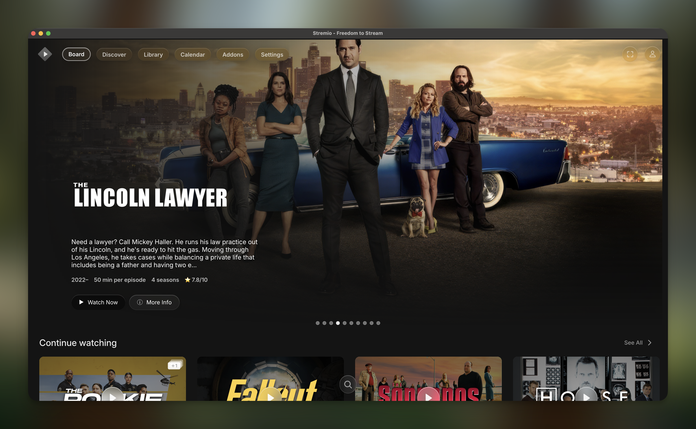
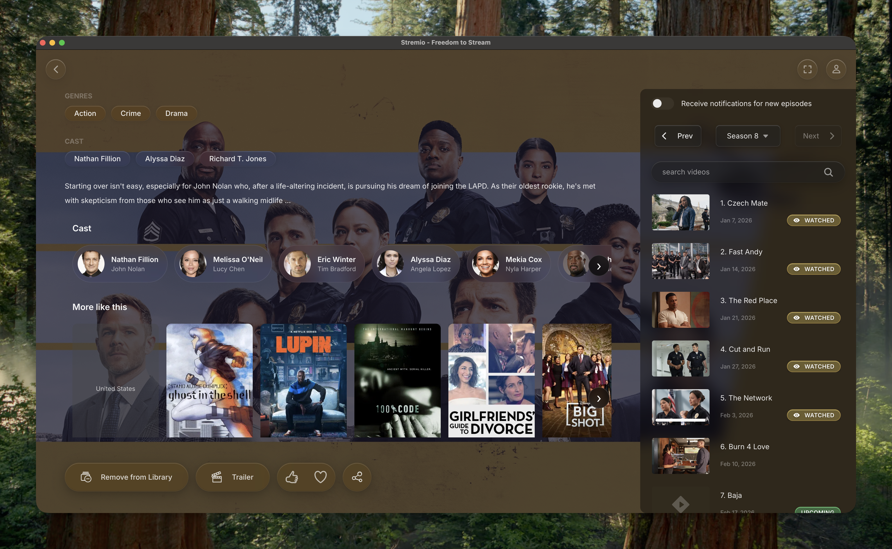
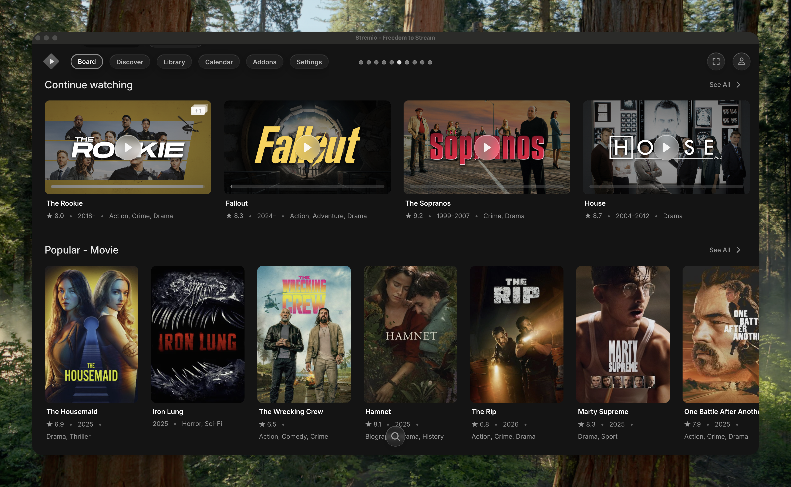
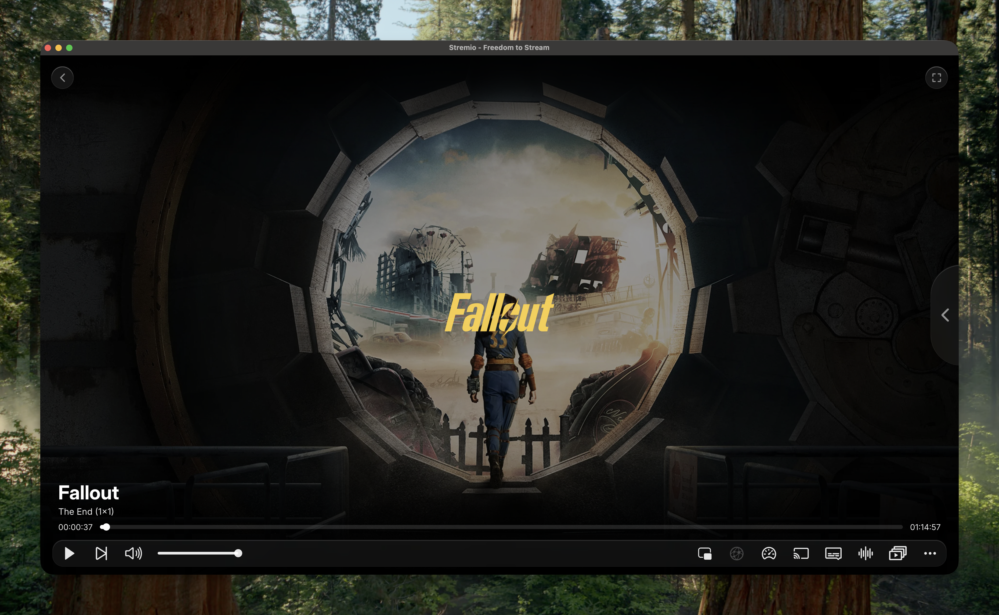
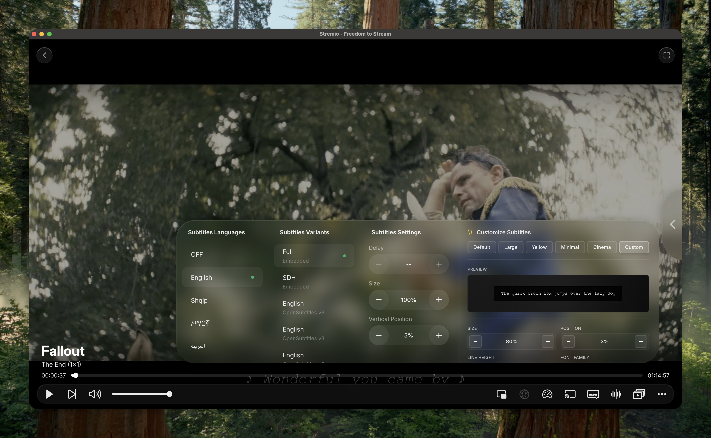
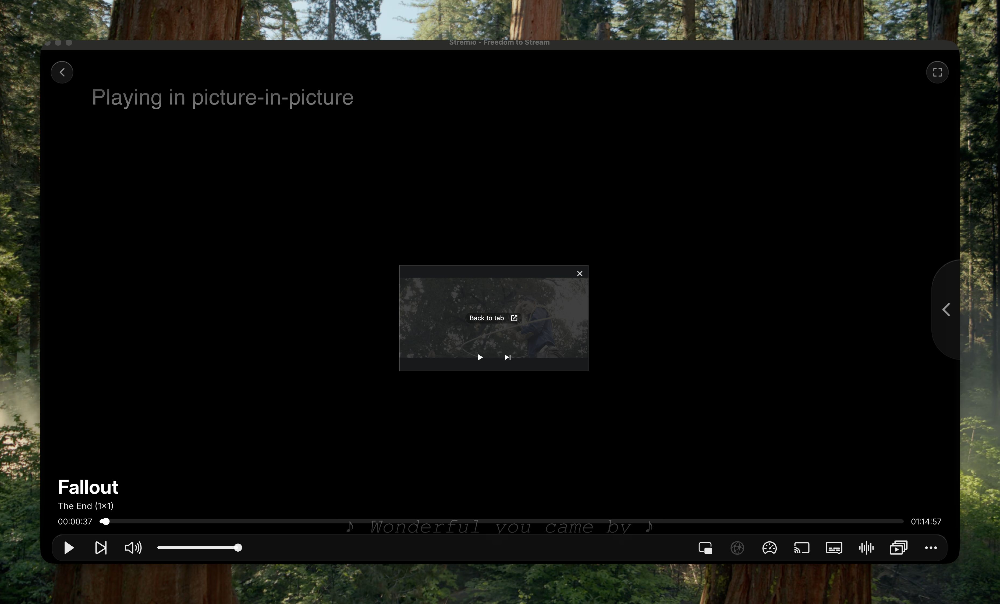
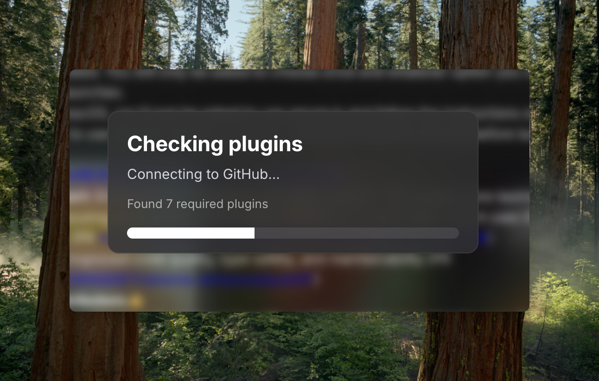

# Modern Glass – Stremio Theme + QoL Enhancements  

  

**Modern Glass** is a complete visual overhaul for Stremio Enhanced.  
It brings a sleek, glass-like aesthetic combined with powerful quality-of-life improvements for a truly modern streaming experience.  

---

## ✨ Features  

### 🎨 Theme Highlights  
- 🌟 **Glass-like transparent interface** for a clean, modern look   
- 🖼️ **High-quality, wide cover art** for movies & series  
- 🧩 **Refined UI layout** – better spacing, typography, and animations  

---

### 🔧 Quality of Life Plugins  

| Plugin | Description |
|--------|-------------|
| **horizontal-navigation.plugin.js** | Moves the vertical navigation bar to a **horizontal** position |
| **enhancedcovers.plugin.js** | Widens and improves cover images in the library with robust DOM handling |
| **enhancedvideoplayer.plugin.js** | Comprehensive video player enhancement with **subtitle customization UI**, presets, and persistent storage |
| **enhancedtitlebar.plugin.js** | Displays additional information in the title bar |
| **dynamichero.plugin.js** | Netflix-style **rotating hero banner** on the homepage |
| **moveprogressbar.plugin.js** | Moves the watch progress bar inside the title container |
| **picture-in-picture.plugin.js** | Fully updated and restored Picture-in-Picture functionality |
| **initializer.plugin.js** | Handles plugin initialization and ensures proper loading order |
| **data-enrichment.plugin.js** | Enriches metadata with **TMDB→IMDB resolution**, poster click handlers, and enhanced navigation |
| **context-menu-fix.plugin.js** | Fixes context menu positioning with robust MutationObserver, navigation menu portal, and cleanup logic |

---

## 🆕 Recent Updates  

### **Latest Enhancements**
- ✅ **Subtitle Customization UI** – Full control over subtitle appearance with presets and custom styling
- ✅ **Data Enrichment** – Automatic TMDB→IMDB resolution and enhanced poster navigation
- ✅ **Context Menu Improvements** – Fixed positioning with portal-based rendering for menus and dropdowns
- ✅ **Enhanced Covers** – Improved DOM waiting and mutation handling for better reliability
- ✅ **Picture-in-Picture** – Restored and modernized with better controls
- ✅ **Plugin Initialization** – Centralized initialization system for better load management

---

## 📷 Gallery

### 🏠 Home & Navigation
| Main Page | Expanded View |
|-----------|---------------|
|  |  |
| Modern glass interface with dynamic hero banner | Expanded library view with enhanced covers |

### 🎬 Library & Titles
| Titles View |
|-------------|
|  |
| Enhanced title cards with improved metadata and styling |

### 🎥 Video Player
| Video Player | Subtitle Customization | Picture-in-Picture |
|--------------|----------------------|-------------------|
|  |  |  |
| Enhanced playback controls and UI | Full subtitle styling control with presets | Restored PIP functionality |

### ⚙️ Plugin Features
| Initializer |
|-------------|
|  |
| Plugin initialization and management system |

---

## 📥 Installation  

You have **two ways** to install Modern Glass:  

### 1. Via Stremio Enhanced Marketplace (Recommended)
- Open **Stremio Enhanced Marketplace** inside Stremio → Settings → Scroll all the way down
- Search for **Modern Glass** and its Plugins tagged with **Modern Glass**  
- Install the theme and desired plugins
- Restart Stremio to apply changes

### 2. Direct Download / Manual Installation
- Download the latest release from the [Releases Page](#)  
- Install Stremio Enhanced (required)  
- Drag and drop the downloaded files into your Stremio plugin/theme folder  
- Restart Stremio to apply changes  

---

## 🖥️ Requirements  
- **Stremio Enhanced** installation (mandatory)
- All included plugins are bundled in the release package
- Compatible with latest Stremio versions

---

## 🔧 Plugin Details

### Enhanced Video Player
The video player now includes:
- **Subtitle Customization UI** with live preview
- **Preset styles** for quick styling
- **Persistent settings** across sessions
- Font size, color, background, and positioning controls
- Enhanced playback controls

### Data Enrichment
- Automatic metadata enhancement
- TMDB to IMDB ID resolution
- Clickable posters that navigate to detail pages
- Improved data fetching and caching

### Context Menu Fix
- Fixed menu positioning issues
- Portal-based rendering for dropdowns
- Improved navigation menu handling
- Season dropdown improvements
- Automatic cleanup on unmount

---

## 🧪 Known Issues  

Modern Glass is actively maintained and evolving.  
You may encounter occasional bugs or unexpected behavior — please report them via the **Issues tab**.

**Current Known Issues:**
- Some plugins may need initialization time on first load
- Context menus may flicker briefly during page transitions
- Subtitle customization requires player reload to apply some changes

---

## 🌐 Join the Community  

Want to discuss Stremio mods, share your own plugins, get coding help, or just hang out with other creators?  
Join our growing community:  

- **Reddit:** [r/StremioMods](https://www.reddit.com/r/StremioMods/)  
- **Discord:** [Join our Discord Server](https://discord.gg/qxDpXdq6)  

This community is open to **everyone** — plugin creators, theme designers, and users who want to learn, share, and improve the Stremio experience together.  

---

## 🤝 Contributing  

We welcome community contributions!  

1. Fork the repo  
2. Create a feature branch  
3. Commit your changes  
4. Push and submit a PR  

**Areas where contributions are welcome:**
- Bug fixes and stability improvements
- New plugin ideas
- UI/UX enhancements
- Documentation improvements
- Testing and feedback

---

## 📝 Changelog

### Version [Current]
- Added comprehensive subtitle customization system
- Implemented data enrichment with TMDB→IMDB resolution
- Fixed context menu positioning and portal rendering
- Restored and enhanced Picture-in-Picture functionality
- Improved plugin initialization system
- Enhanced covers with better DOM handling
- Various performance and stability improvements

---

## ⚠️ Disclaimer  

- Not officially affiliated with Stremio  
- This is an ongoing project – code quality and structure will improve over time  
- Feedback and suggestions are highly appreciated ❤️  
- Use at your own discretion

---

## 💖 Support

If you enjoy Modern Glass, consider:
- ⭐ Starring this repository
- 🐛 Reporting bugs and issues
- 💡 Suggesting new features
- 🔄 Sharing with the community

---

**Made with ❤️ by the Stremio Mods Community**
